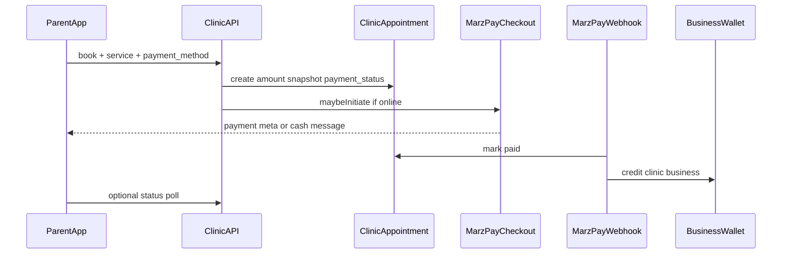

# Clinics — MarzPay Parent Billing Spec

**Status:** Spec (not implemented)  
**Phase 1 focus:** Pay at appointment booking (mirror kids-event / Parent Corner MarzPay)  
**Phase 2 outline:** Clinic-issued post-visit bills  
**Related docs:** `docs/KIDS_CLINICS_E2E_TEST.md` (linking only), `docs/GUEST_PARENT_UNIVERSAL_ACCOUNT_SPEC.md`

---

## 1. Problem

Kids Clinics already expose priced services (`ClinicService.price`) and let parents book appointments, but:

- Service price is **display-only** in the app
- `ClinicAppointment` has **no payment fields**
- Booking API (`bookPatientAppointment`) does not collect `payment_method` or initiate MarzPay
- Clinic businesses are **not credited** via the existing wallet / `PaymentCollection` path for appointments

Parents cannot pay clinics through Quisat the way they already pay for kids events, Parent Corner, programs, and orders.

---

## 2. Goals (Phase 1)

1. Bill parents for clinic services at **appointment booking** when the selected service has a price.
2. Reuse the existing MarzPay stack (`MarzPayCheckoutService`, webhooks, `PaymentCollection`, business wallet credit).
3. Support the same payment methods pattern as kids events: cash / card / bank / Airtel / MTN / other.
4. Show payment status to parents (app) and clinic staff (web).
5. Allow clinic staff to mark cash (and similar offline) appointments as paid.

---

## 3. Non-goals (Phase 1)

- Insurance claims / pre-authorization
- Multi-line carts or “pay for several services at once”
- Partial payments or refunds via MarzPay
- Automatic charging without a booking
- Guest (anonymous) clinic booking/payment — Phase 1 requires authenticated `ParentGuardian` with a linked patient (existing attach flow)

Phase 2 (outlined below): clinic staff create ad-hoc bills after a visit.

---

## 4. Current state

| Area | Today |
|------|--------|
| `ClinicService` | Has `name`, `price`, `duration_minutes`, etc. |
| `ClinicAppointment` | `scheduled_at`, `doctor_name`, `appointment_type`, `status` — no amount/payment |
| Booking | `POST .../patients/{patient}/appointments` — no payment |
| MarzPay payables | `Order`, `KidsEventRegistration`, `ParentCornerRegistration`, `EventAttendee` |
| RN | `ClinicDetailScreen` shows price text; `ClinicPatientProfileScreen` books without payment UI |

Key files:

- `app/Http/Controllers/API/ClinicController.php` (`bookPatientAppointment`)
- `app/Models/ClinicAppointment.php`
- `app/Models/ClinicService.php`
- `app/Services/MarzPayCheckoutService.php`
- `app/Services/MarzPayPayableResolver.php`
- `app/Models/Concerns/InteractsWithMarzPay.php`
- `src/utils/marzPay.ts` (`showMarzPayRegistrationAlert`)
- `src/screens/ClinicPatientProfileScreen.tsx`

---

## 5. Design decision (locked)

**Payable = `ClinicAppointment`** (extend the existing model), not a separate invoice table in Phase 1.

Rationale: one booking ↔ one charge matches kids-event registration; less schema; webhook resolves a single morph target.

Phase 2 introduces `ClinicBill` for post-visit / ad-hoc charges not tied to the original booking amount.

---

## 6. Data model

### 6.1 Columns added to `clinic_appointments`

| Column | Type | Notes |
|--------|------|--------|
| `clinic_service_id` | nullable FK | Prefer FK over matching `appointment_type` string alone |
| `amount` | decimal/int | Snapshot of price at booking time (UGX integer preferred, consistent with MarzPay) |
| `currency` | string | Default `UGX` |
| `payment_method` | string nullable | `cash`, `card`, `bank_transfer`, `airtel_money`, `mtn_mobile_money`, `other` |
| `payment_status` | string | `pending` \| `paid` \| `failed` \| `waived` \| `not_required` |
| `paid_at` | timestamp nullable | |
| `payment_notes` | text nullable | Staff mark-paid notes |

Existing `appointment_type` can remain for display/history; when booking, resolve service by id or by name within clinic and set both `clinic_service_id` and `appointment_type`.

### 6.2 Payment status meanings

| Status | Meaning |
|--------|---------|
| `not_required` | Service price is null/0 — free booking |
| `pending` | Awaiting online completion or cash confirmation |
| `paid` | MarzPay completed or staff marked paid |
| `failed` | Online collection failed |
| `waived` | Staff waived fee (document who/why in notes) |

### 6.3 MarzPay integration on model

`ClinicAppointment` implements the same contract as `KidsEventRegistration`:

- `use InteractsWithMarzPay`
- `marzPayAmount(): int` → `(int) round($this->amount)`
- `marzPayDescription(): string` → e.g. `Clinic appointment: {service} — {patient}`
- `marzPayPhoneNumber(): ?string` → parent phone via `patient.parentGuardian` or booking parent
- `markMarzPayCompleted()` → `payment_status=paid`, set `paid_at`
- `markMarzPayFailed()` → `payment_status=failed`

### 6.4 Resolver updates

In `MarzPayPayableResolver`:

- `resolve('clinic_appointment', $id|$uuid)`
- `payableTypeKey` → `clinic_appointment`
- `resolveBusiness` → `$payable->business` (appointment already has `business_id`)

Webhook + manual collect endpoints that allowlist payable types must include `clinic_appointment`.

---

## 7. Booking + payment flow (Phase 1)



### 7.1 Amount resolution

1. Client sends `clinic_service_id` **or** `appointment_type` (existing).
2. Server loads `ClinicService` for that clinic (`business_id` match, active).
3. Snapshot `amount` from `ClinicService.price` at booking time (do not re-read later for MarzPay amount).
4. If price missing or `≤ 0` → `payment_status = not_required`; `payment_method` optional/ignored for charge.

### 7.2 Payment method rules

| Method | Behavior |
|--------|----------|
| `mtn_mobile_money`, `airtel_money`, `card` | Online via `MarzPayCheckoutService::maybeInitiate` |
| `cash`, `bank_transfer`, `other` | Appointment saved `pending`; staff confirms → `paid` |
| Online but amount/total below MarzPay threshold (`total < 500` after charge, or amount `< 1`) | Same as kids events: save booking, return `payment_error` guidance; keep `pending` |

Reuse `registrationPaymentMeta()` messages adapted for clinics (“Appointment saved. Complete payment to confirm.”).

### 7.3 Appointment `status` vs payment

Keep scheduling status separate from payment:

| `status` (existing) | Payment interaction |
|---------------------|---------------------|
| `scheduled` | Default on create even if payment pending |
| `cancelled` | No auto-refund in Phase 1 |
| `completed` / `no_show` | Unchanged |

**Product rule (Phase 1):** Clinic may still see and manage `scheduled` appointments with `payment_status=pending`. Optional later: auto-hold confirmation until paid — **not required for Phase 1**.

### 7.4 Wallet credit

On MarzPay `completed` webhook → existing `applyCallback` → `BusinessWalletService::creditFromCollection` for the clinic `Business`. Offline mark-paid does **not** create a MarzPay collection unless staff explicitly records cash outside MarzPay (Phase 1: mark-paid only updates appointment fields; no fake wallet credit for cash unless product later requires it).

**Locked Phase 1:** Cash/bank mark-paid updates `payment_status` only. Wallet credit applies to **successful MarzPay collections** only (consistent with treating cash as outside the online rails).

---

## 8. API contracts

### 8.1 Book appointment (extend existing)

`POST /api/v1/parent/clinics/{clinicId}/patients/{clinic_patient}/appointments`

**New/updated body fields:**

```json
{
  "doctor_name": "Dr. Amina",
  "clinic_service_id": 12,
  "appointment_type": "General checkup",
  "scheduled_at": "2026-07-20T10:00:00+03:00",
  "notes": "optional",
  "payment_method": "mtn_mobile_money"
}
```

Validation:

- `payment_method` required when resolved amount `> 0`
- `payment_method` optional when `not_required`
- Service must belong to clinic

**Response** (mirror kids-event registration):

```json
{
  "success": true,
  "message": "Appointment saved. Complete payment to confirm.",
  "data": {
    "appointment": { "...": "includes amount, payment_method, payment_status" },
    "payment_initiated": true,
    "payment_error": null,
    "payment": { "reference": "...", "...": "MarzPay payload" }
  }
}
```

### 8.2 Payment status

`GET /api/v1/payments/marzpay/{reference}/status` — existing; ensure clinic appointments resolve.

Optional:

`GET /api/v1/parent/clinics/{clinicId}/appointments/{appointment}` — include payment fields.

### 8.3 Staff mark paid / waive

Web or API (staff auth, clinic business scope):

`POST /clinic-appointments/{id}/mark-paid`  
`POST /clinic-appointments/{id}/waive`  

Body: `{ "notes": "optional" }` → sets `payment_status`, `paid_at` when paid.

### 8.4 Manual MarzPay collect

Existing `POST /api/v1/payments/marzpay/collect` should accept `payable_type: clinic_appointment` + id/uuid for retry.

---

## 9. App UX (React Native)

1. On book appointment sheet/screen:
   - Show selected service **price** clearly
   - If price `> 0`, show payment method selector (reuse kids-event control pattern)
   - If free, hide payment methods / show “No payment required”
2. On submit success:
   - Call `showMarzPayRegistrationAlert` (or a thin clinic-named wrapper) with payment meta
3. Appointment list/cards:
   - Badge: Paid / Pending / Failed / Free
4. Failed online payment:
   - Allow retry collect if API supports it; or re-book guidance

Guest browse of clinics remains view-only for booking (must log in as parent and link child first) — unchanged from current attach rules unless Guest Parent spec lands first.

---

## 10. Clinic web UX

1. Appointments table/list: columns for **Amount**, **Payment method**, **Payment status**.
2. Row actions: **Mark as paid** (cash/bank), **Waive**, link to MarzPay collection if any.
3. Patient profile schedule modal: show whether parent paid.
4. Services admin (existing): reinforce that **price drives parent billing at booking**.

---

## 11. Security & integrity

- Only the parent who owns `clinic_patient.parent_guardian_id` may book/pay for that patient.
- Amount is server-side snapshot — never trust client-sent price.
- Staff mark-paid/waive restricted to users of that clinic `business_id`.
- Idempotent webhooks: do not double-credit wallet (`business_credited_at` guard already exists).
- Rate-limit booking + payment initiate per parent.

---

## 12. Migration / rollout

1. Migration adding payment columns + optional `clinic_service_id` to `clinic_appointments`.
2. Backfill: existing appointments → `payment_status = not_required` (or `waived` if preferred for historical).
3. Wire `InteractsWithMarzPay` + resolver + payment controller allowlists.
4. Update `bookPatientAppointment` + RN booking UI.
5. Staff mark-paid UI.
6. Feature flag optional: `clinics.marzpay_billing` per business — **nice-to-have**; Phase 1 can ship on for all Kids Clinics businesses.

---

## 13. Edge cases

| Case | Expected |
|------|----------|
| Service price changed after booking | Charged amount stays as snapshot on appointment |
| Service deleted after booking | Appointment retains snapshot amount + `appointment_type` text |
| Online initiate fails | Appointment still created `pending`; return `payment_error` |
| Parent books free service | `not_required`; no payment_method required |
| Double webhook completed | Single wallet credit |
| Cancel appointment after paid | No auto-refund Phase 1; staff handle offline |
| Parent phone missing for MoMo | Initiate fails with clear error; keep pending; suggest cash or update phone |

---

## 14. Test plan

### API

- [ ] Book paid service with MTN → appointment `pending`, `payment_initiated` true when MarzPay succeeds
- [ ] Book free service → `not_required`, no MarzPay call
- [ ] Webhook completed → `paid` + clinic wallet credited once
- [ ] Webhook failed → `failed`
- [ ] Cash book → `pending`; staff mark-paid → `paid` (no wallet credit)
- [ ] Staff waive → `waived`
- [ ] Parent cannot book another parent’s patient
- [ ] Client-sent fake amount ignored

### App

- [ ] Payment method UI only when price > 0
- [ ] MarzPay alert shows on online success/failure paths
- [ ] Appointment shows payment badge

### Regression

- [ ] Existing clinic attach (`CHD-`) unchanged
- [ ] Kids event / order MarzPay still works
- [ ] Booking without Kids Clinics MarzPay columns fails migration on old code — covered by migrate

---

## 15. Phase 2 outline — Clinic-issued bills

**Problem:** Visit may cost more than the booked service (labs, meds, follow-up).

**Sketch:**

- New model `ClinicBill` (`business_id`, `clinic_patient_id`, `parent_guardian_id`, `clinic_appointment_id?`, `amount`, `description`, `payment_*`, `due_at`)
- Also `InteractsWithMarzPay`; resolver key `clinic_bill`
- Staff creates bill on web → parent gets push/in-app notification → pays in app
- Does not replace Phase 1 booking charge; additive

Out of scope for Phase 1 implementation and detailed API design beyond this outline.

---

## 16. Implementation notes for engineers

Suggested order:

1. Migration + model MarzPay methods
2. `MarzPayPayableResolver` + payment controller allowlist
3. Extend `ClinicController::bookPatientAppointment`
4. Staff mark-paid / waive (Livewire or controller)
5. RN booking payment UI + alert
6. Appointments list payment badges (app + web)

Mirror reference implementation:

- `KidsEventRegistration` + `KidsEventRegistrationController` + `RegisterChildScreen` + `showMarzPayRegistrationAlert`

---

## 17. Open questions (non-blocking)

1. Should unpaid online appointments auto-cancel after N hours?
2. Should cash payments optionally create a manual ledger entry for clinic reporting?
3. Multi-currency later, or UGX-only indefinitely?

Phase 1 ships UGX snapshot + existing MarzPay thresholds without answering these.
